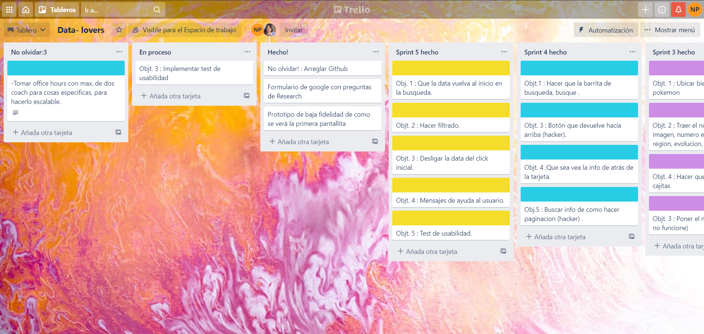
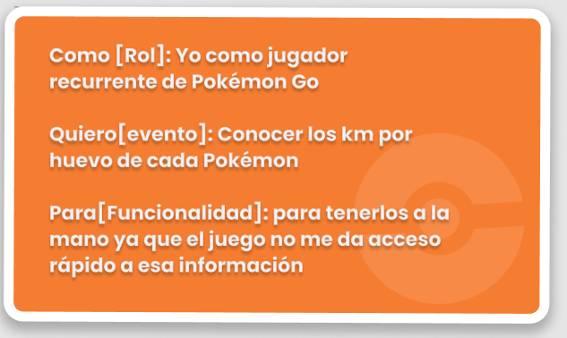
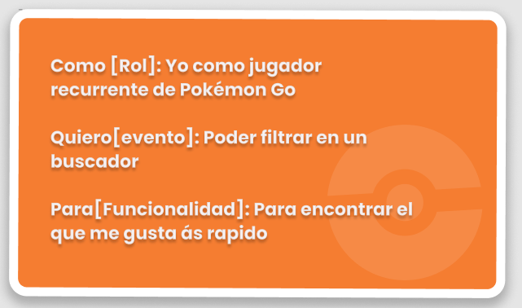
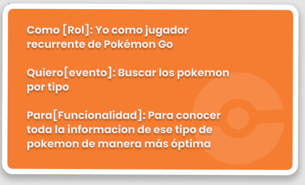
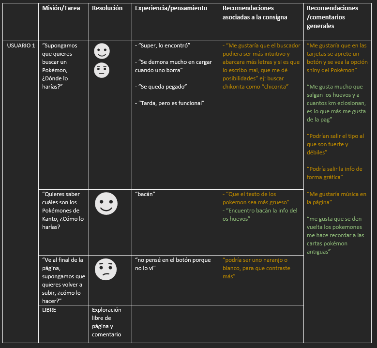
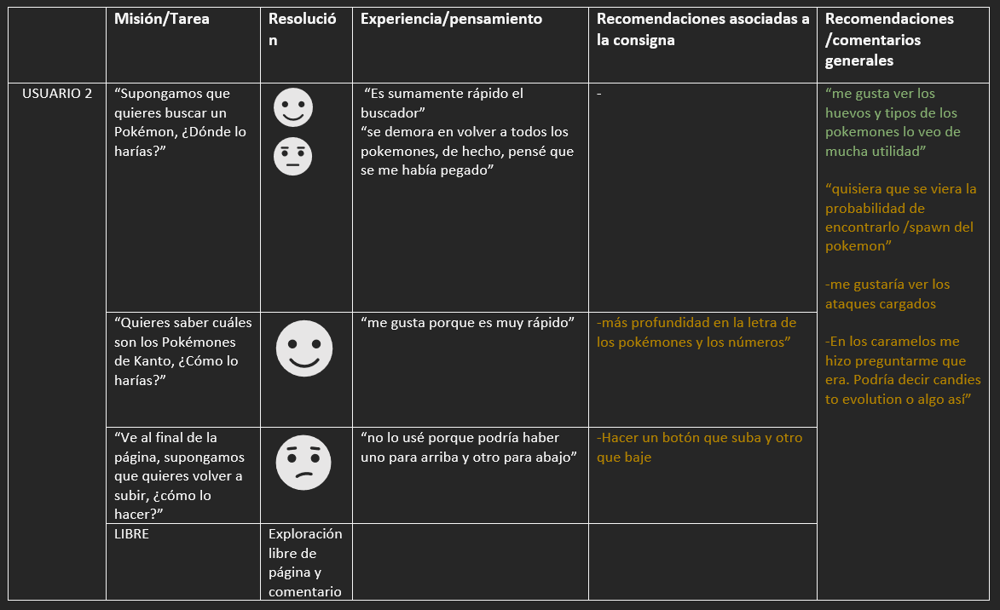
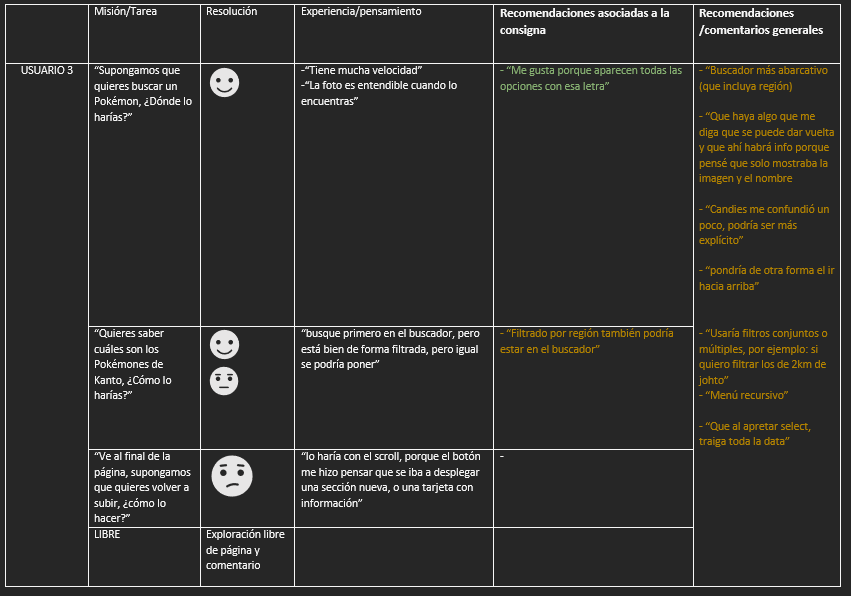

# "GO DATA"

## Índice

* [1. Definición del Producto](#1-Definición-del-Producto)
* [2. Organización](#2-Organización)
* [3. Historias de Usuario](#3-Historias-de-Usuario)
* [4. Diseño de la interfaz del usuario](#4-Diseño-de-la-interfaz-del-usuario)
* [5. Testeo de Usabilidad](#5-Testeo-de-Usabilidad)
* [6. Link a "Go Data"](#6-Link-a-go-data)

***

## 1. Definición del Producto
Nuestro producto “GO Data” está diseñado para jugadores de la famosa aplicación diseñada por Niantic: “Pokemon GO”, en ella podrán encontrar toda la información que necesitan para conocer lo necesario de los pokemones de la generación Kanto y Johto, lo que les puede ser útil para cumplir sus diversos desafíos en la aplicación, desde conocer en cuántos kilómetros eclosiona un pokemón, hasta la probabilidad de encontrarlo. 

## 2. Organización
Elegimos la plataforma trello para ir fijando lo que teníamos que hacer por cada Sprint y así ir viendo como  iba avanzando realmente y cómo finalmente iba agarrando forma el proyecto semana a semana.

## 3. Historias de Usuario
Basamos nuestras historias de usuario en preguntas realizadas a usuarios reales con el perfil de “jugador recurrente” en la plataforma “Pokémon Go”. Reunimos sus opiniones y necesidades en un formulario Google que contenía las siguientes preguntas : 
* ¿Qué te gustaría que apareciera en la página?
* ¿Qué pokemones te gustaría que aparecieran?
* Si dijiste de Kanto y Johto, ¿Cuáles en específico?
* En cuanto al filtrado, ¿ Que sería algo atractivo de encontrar en esta sección?
* ¿Para qué usarías esta página? ¿ Cuál crees que sería su utilidad?

#### Historia 1 

#### Historia 2 

#### Historia 3 

## 4. Diseño de la interfaz del usuario
La interfaz de usuario fue diseñada en base a las historias de usuario y el research de los mismos. Primeramente diseñamos un prototipo de baja fidelidad en la plataforma “InVision” para posteriormente realizar la de alta fidelidad en la plataforma “Figma”.

#### Prototipo de baja fidelidad

Click para ver

#### Prototipo de alta fidelidad

## 5. Testeo de Usabilidad
Los test de usabilidad los realizamos con 3 usuarios varones que van desde los 11 años a los 27 años de edad, todos usuarios recurrentes de “Pokémon GO”. Para testear la web, les dimos a cada uno 3 misiones o tareas a realizar en la misma y una exploración libre por la página comentando sus recomendaciones y sensaciones.
Las Misiones eran las siguientes: 
* “Supongamos que quieres buscar un Pokémon, ¿Dónde lo harías?”
* “Quieres saber cuáles son los Pokémones de Kanto, ¿Cómo lo harías?”
* “Ve al final de la página, supongamos que quieres volver a subir, ¿cómo lo harías?” 
* Explora libremente por la página, ¿hay alguna recomendación?

A continuación se muestran imágenes a modo tabla con los hallazgos del test de usabilidad
#### Usuario 1 

#### Usuario 2

#### Usuario 3

## 6. Link a "GO data"