# Wubba Lubba

## Definición de producto
Wubba Lubba es un pagina web orientada a fanaticos y seguidores de la serie Rick and Morty en ella los usuarios podran ver contenido descriptivo de los personajes, especificamente podran realzar busquedas de personajesa a eleccion, podran ordenar las fichas de los personajes de forma alfabetica ya sea ascendente o descendente y podran filtrar personajes en base a su tipo de especie, esto debido a la gran diversidad de criaturas que se encuentra presente en esta serie.

## Historias de usuario
Para crear nuestras historias de usuario tomamos como referencia los usuarios mencionados en la rubrica inicial del proyecto y opiniones de seguidores de la serie. 

#### Historia 1
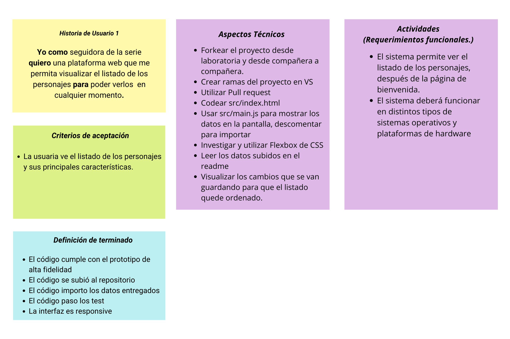

#### Historia 2
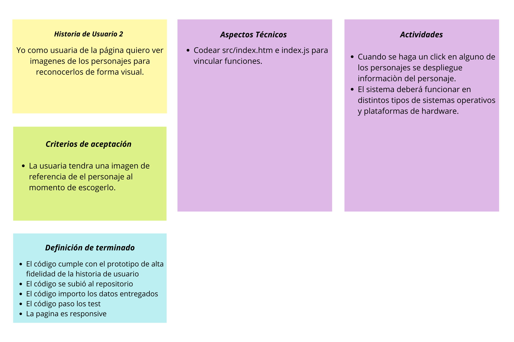

#### Historia 3
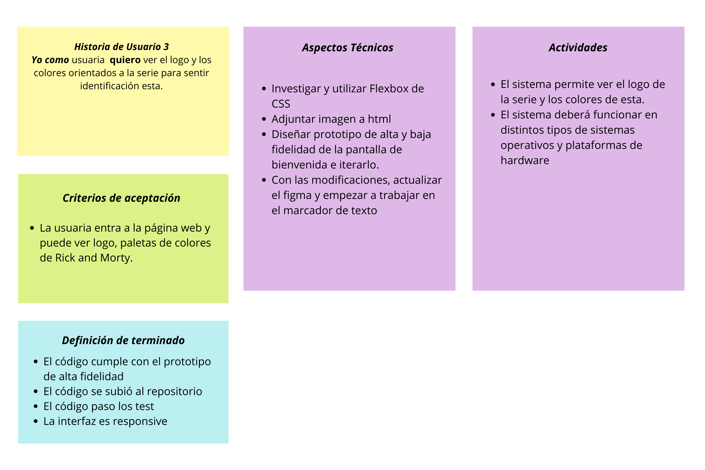

#### Historia 4 
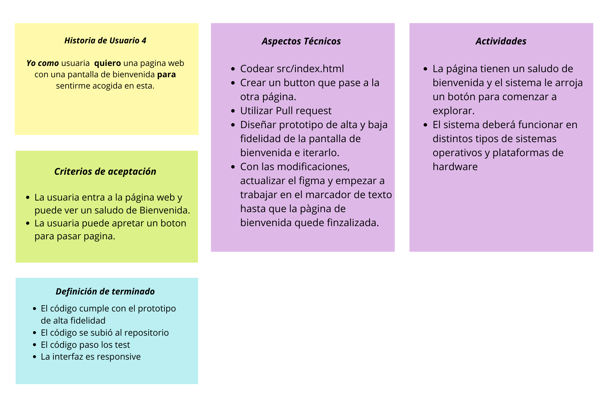

#### Historia 5
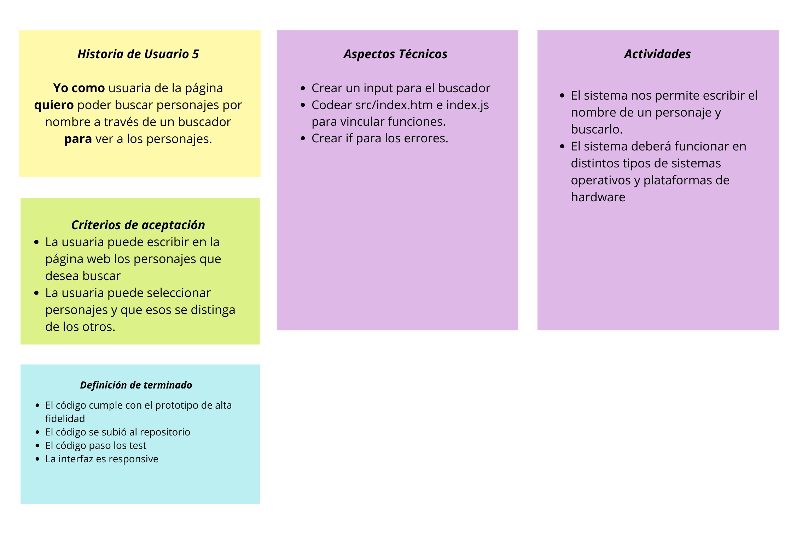

#### Historia 6 
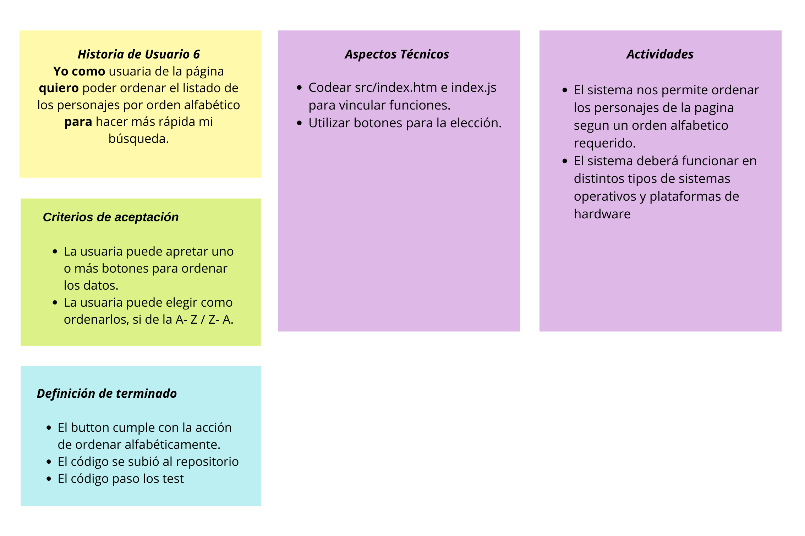

#### Historia 7
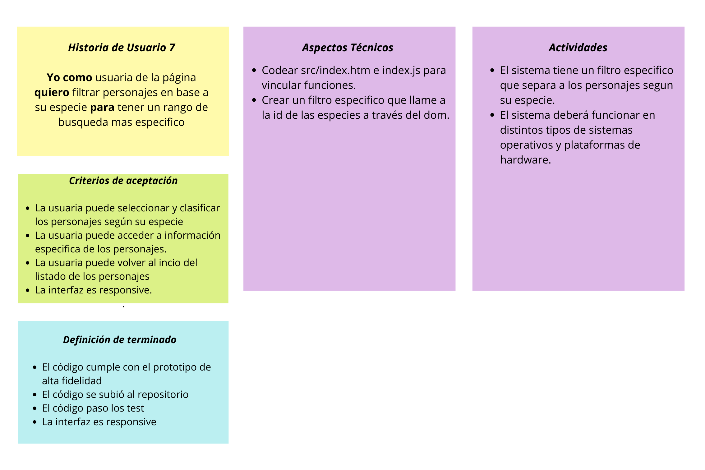

## Prototipo de baja fidelidad

* #### *Primera pantalla*
Nuestra pantalla inicial cuenta con un mensaje descriptivo que induce al usuario en el contenido de la pagina y un boton que los traslada a la pagina en donde se presenta la data.

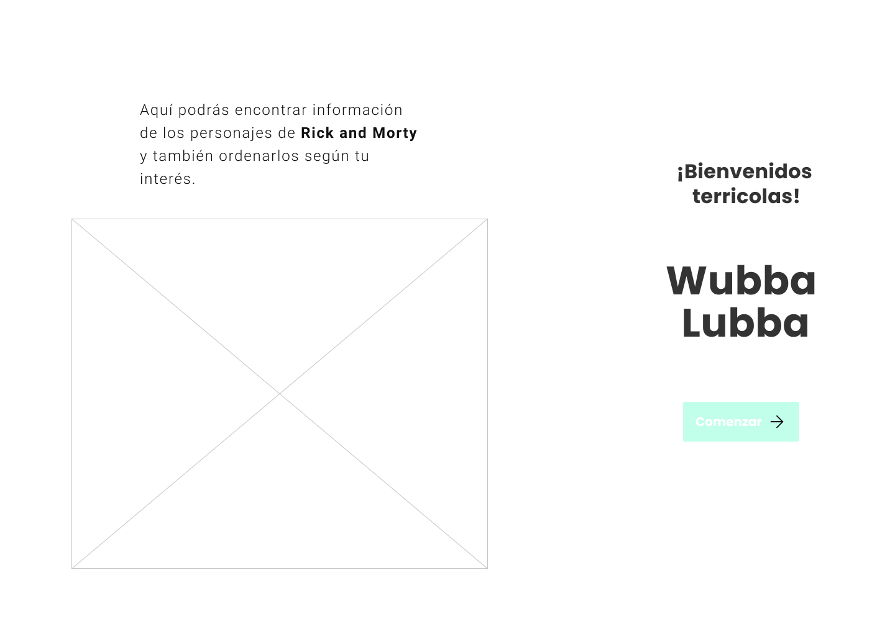

* #### *Segunda Pantalla*
En nuestra sengunda pantalla se presentan las fichas de los personajes por orden de relevancia, pero pueden recurrir al selector en donde le dan un orden alfabetico a los personajes o tambien a los filtros de tipos de especie, de igual manera si lo desean encontraraán en la esquina superior derecha un input donde pueden buscar sus personajes con sus respectivos nombres. En las fichas de los personajes encontrarán un boton que los llevara a un modal que les muestra mas informacion de los personajes.

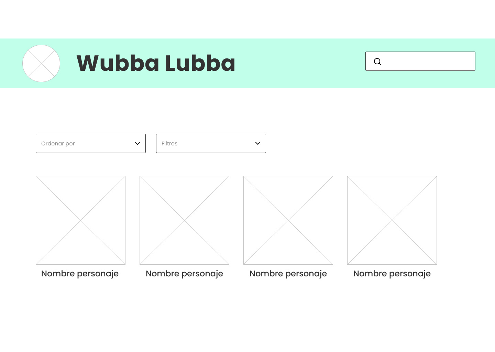

* #### *Modal*
En la ultima pantalla el usuario podra ver un modal que entrega más informacion de su personaje a elección y asi aprender mas sobre el. 

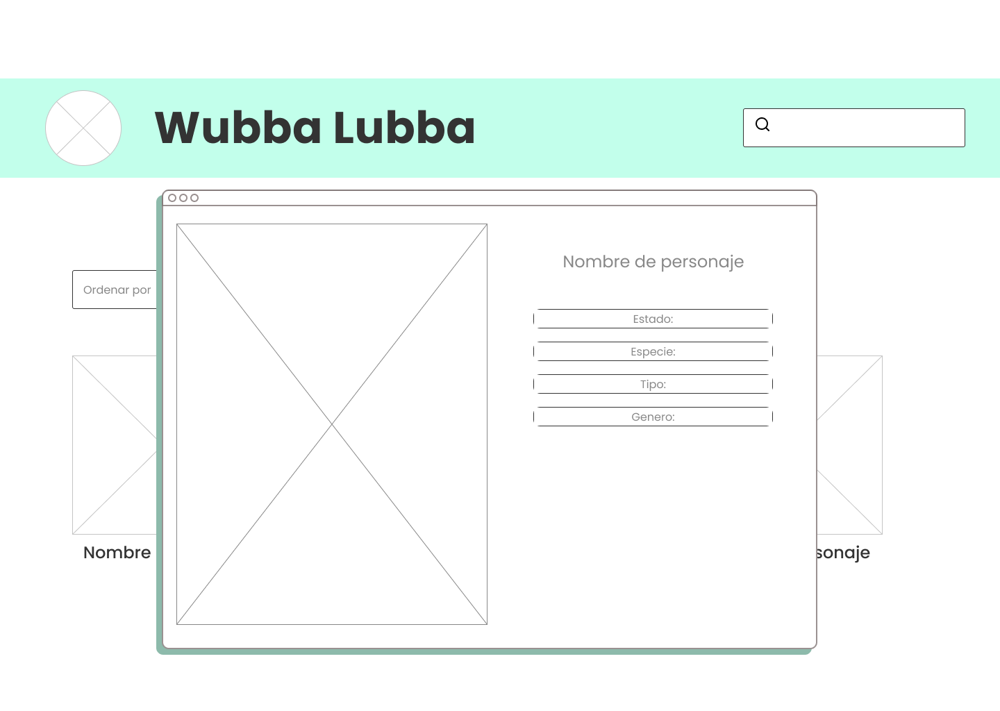

## Prototipo de alta fidelidad

* #### *Primera pantalla*
Luego de iterar nuestros prototipos de baja fidelidad  comenzamos con el diseño de nuestro prototipo de alta fidelidad, nos enfocamos en crear una paleta de colores orientada a la serie para asi familiarizar a los personajes visualmente.

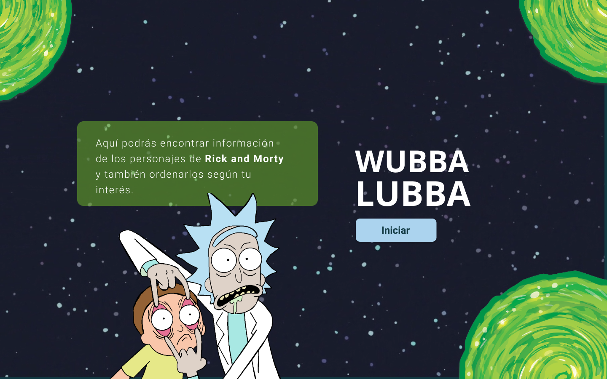

* ### *Segunda pantalla*
En nuestra segunda pantalla el usuario se encuentra con el selector para darle orden a los personajes y filtros para focalizar la busqueda de el personaje, tambien se observa un header en donde se ubica el buscador en donde podra ingresar el nombre del personaje que desee ver.

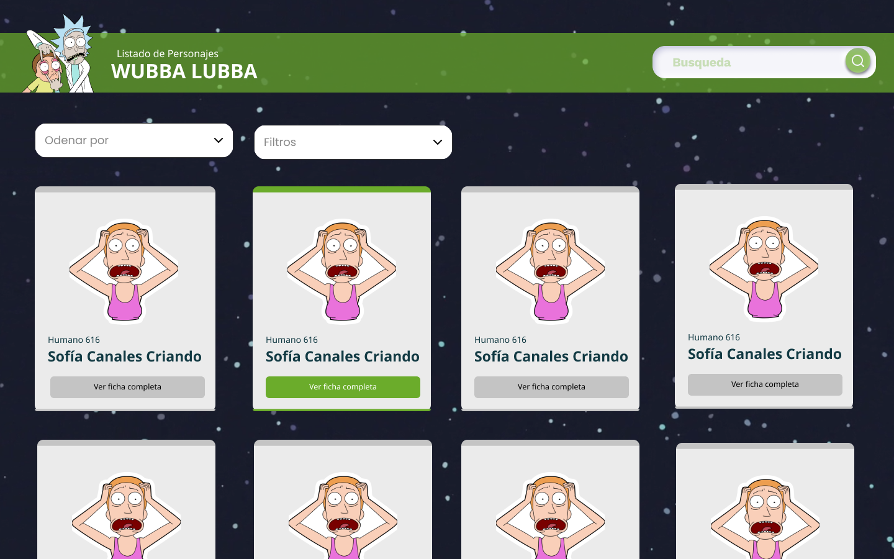

* ### *Modal*
Nuestro modal se hace visible gracias al boton presente en la pantalla dos ubicado en la ficha del personaje, al momento de clickear se muestra una ventana que nos muestra mayor informacion referente a nuestro personaje. 

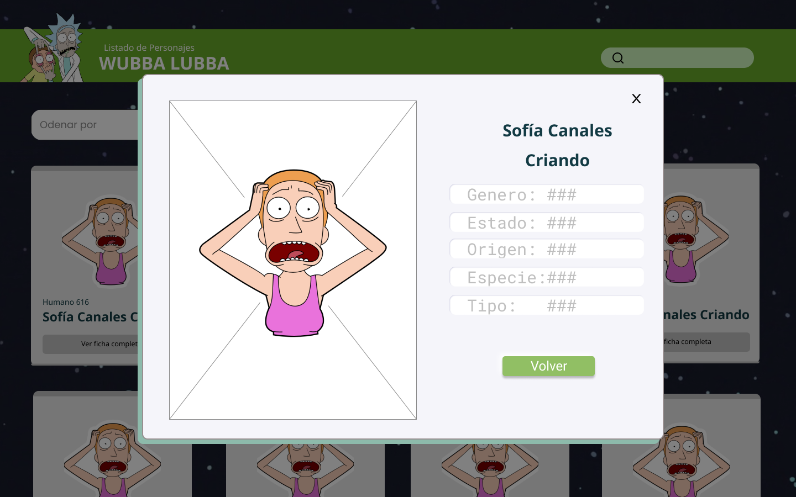

## Test de Usabilidad 
En nuestros test de usabilidad estuvieron mas presentes:
* Problemas en el orden jerárquico de nuestra pagina.
* Errores en el funcionamiento de los selectores.
* Problemas en la distribucion de las historias de usuario. 
* Problemas con el responsive: Los elementos perdian su lugar.

Para mejorar investigamos más respecto a diseño web y buscamos diferentes opciones que nos fueran útiles para poder lograr un resultado final mas acorde a lo que nuestro usuario deseaba. 

## Link del proyecto
https://estefanianeira.github.io/SCL017-data-lovers/

