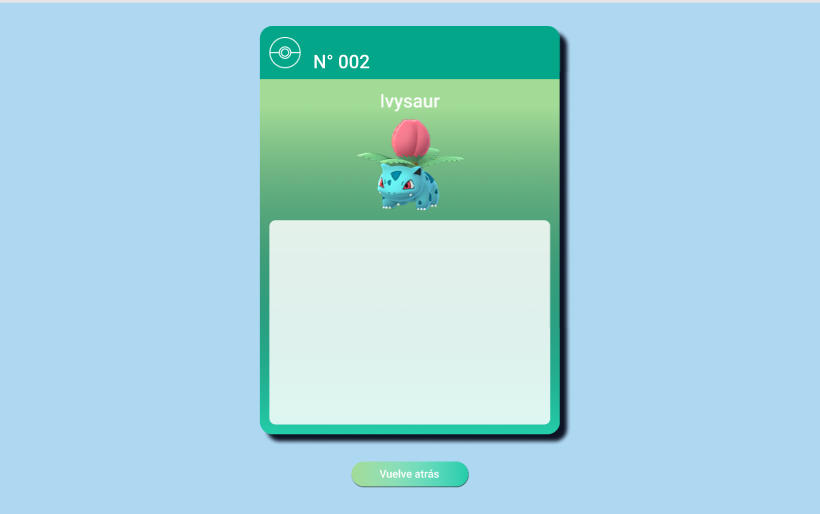

# El Laboratorio del profesor Oak

## Definición del producto

El Laboratorio del Profesor Oak es un sitio creado para usuarios de Pokemon Go, con el objetivo de que puedan obtener información acerca de los Pokemon de Kanto y Johto y así formar el  mejor equipo.

En la barra de búsqueda puedes ingresar el nombre de un Pokemon y se desplegará su tarjeta con una breve descripción, sus debilidades, fortalezas, entre otros.

Si no buscas ninguno es específico, puedes presionar el botón *Quiero verlos todos* y se desplegaran las tarjetas de los 251 Pokemon de Kanto y Johto. Además, los puedes ordenar alfabéticamente, de acuerdo a su número en la Pokedex o por su tipo.

## Historias de Usuario
Para realizar este proyecto creamos historias 3 de usuarios las que representan lo que el usuario puede hacer/ver en nuestro sitio.

La primera Historia de usuario creada fue:

      Yo: como jugador de Pokemon Go,

      Quiero: información de un pokemon específico,

      Para: evaluar su desempeño en una batalla.

Los *Criterios de aceptación* que establecimos para esta historia son: 
- Que existiera una página principal informativa y de bienvenida del sitio.
- Que tuviera una barra de búsqueda donde el/la usuario/a pueda buscar un pokemon y se desplegará su información. 
- Que fuera Responsive.

Por ultimo, establecimos como *Definición de Terminado* lo siguiente:
1. El código abstrae la información de la data correctamente.
2. El código cumple con la guía de estilo del prototipo inicial.
3. La historia ha sido testeada y se han incorporado las mejoras que se identificaron en el testeo de usabilidad.
4. El código esta en el repositorio.

Luego de cumplir con las tareas mencionadas, pasamos a la segunda historia que fue:

Por ultimo, pasamos a la tercera historia de usuario que fue:

## Prototipos
Comenzamos haciendo un sketch del sitio en Papel:

Luego de unir las ideas e iterar sobre los prototipos, pasamos a diseñar la interfaz en Figma. A continuación se adjunta el diseño:

Diseño de pagina bienvenida.

Diseño de pagina donde se despliegan todos los pokemon.

Diseño de tarjeta individual Pokemon.

Diseño mobile del sitio.

En los testeos de usabilidad del diseño, se comentó que el parráfo de bienvenida no era legible, por lo que se dicidió cambiar el diseño y darle mayor notoriedad. Además, de darle mayor tamaño a la tarjeta individual del Pokemon en el diseño mobile.

## Implementación de la Interfaz de Usuario (HTML/CSS/JS)
Luego de establecer el diseño final, comenzamos la implementación de la interfaz a través de código. El flujo de trabajo fue en base a las Historias de Usuario y su definición de terminado. 

El diseño final del sitio:

